# Proyecto_Despliegue_SW_2026

Proyecto académico orientado a la implementación de prácticas de Integración Continua y Despliegue Continuo (CI/CD),
mediante el uso de Git, GitHub y Visual Studio, desarrollando de forma colaborativa una aplicación en ASP.NET Core Web API / MVC y aplicando control de versiones,
manejo de ramas, automatización de procesos y buenas prácticas de despliegue de software.

Integrantes

#1 EDWIN RAMIREZ GONZALEZ

#2 JUAN JOSE RUA DAVID

#3 FELIPE OLAYA BENEITEZ

#4 JULIAN ANDRES RAMIREZ BEDOYA

#5 ARGENIS ALEJANDRO RUIZ COTES

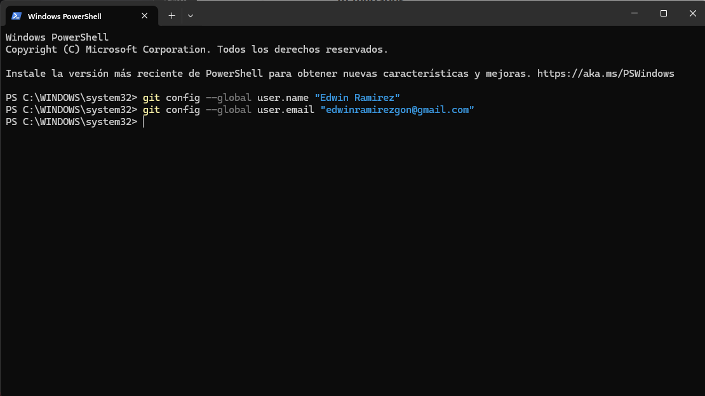

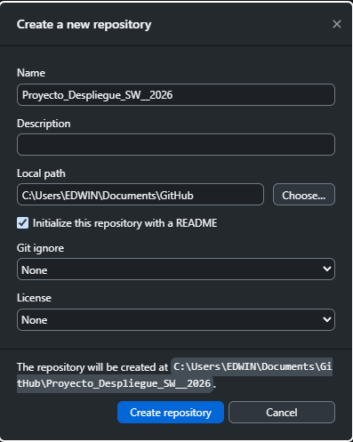

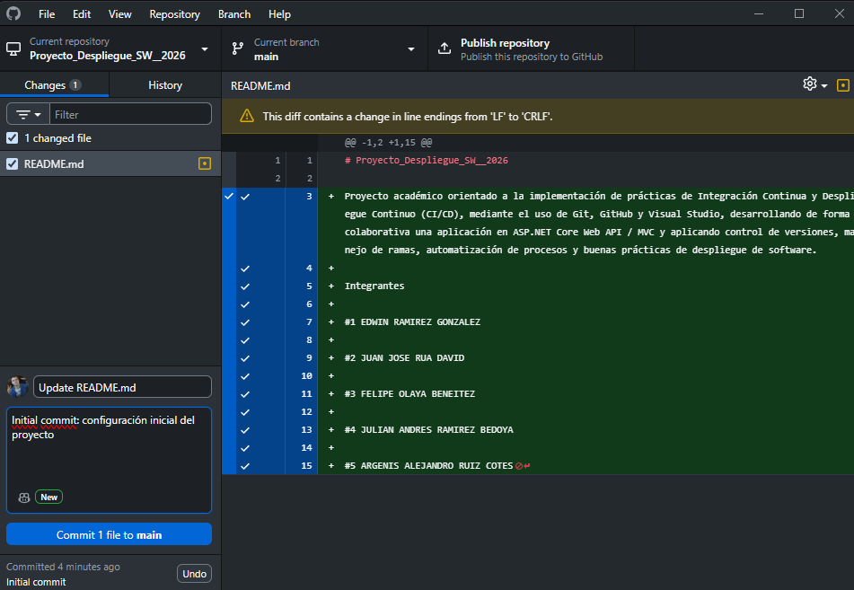

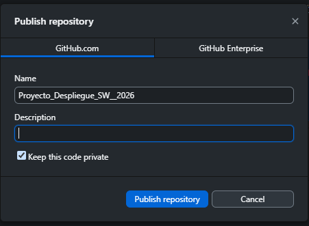

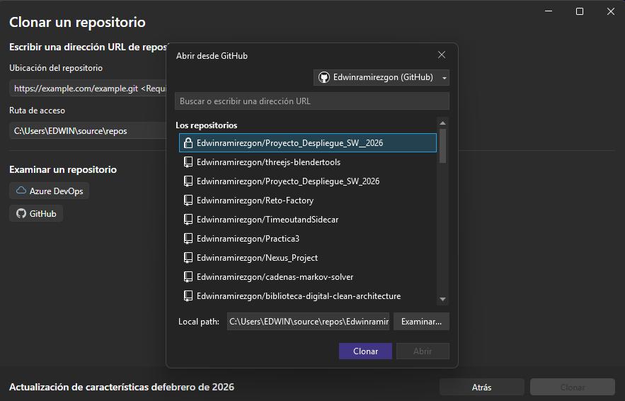

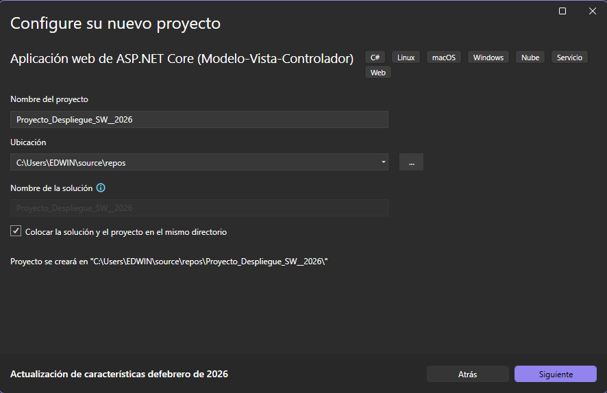

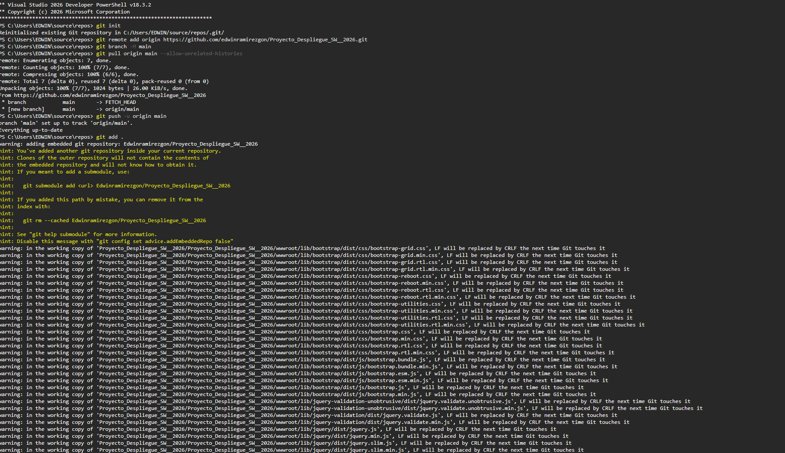

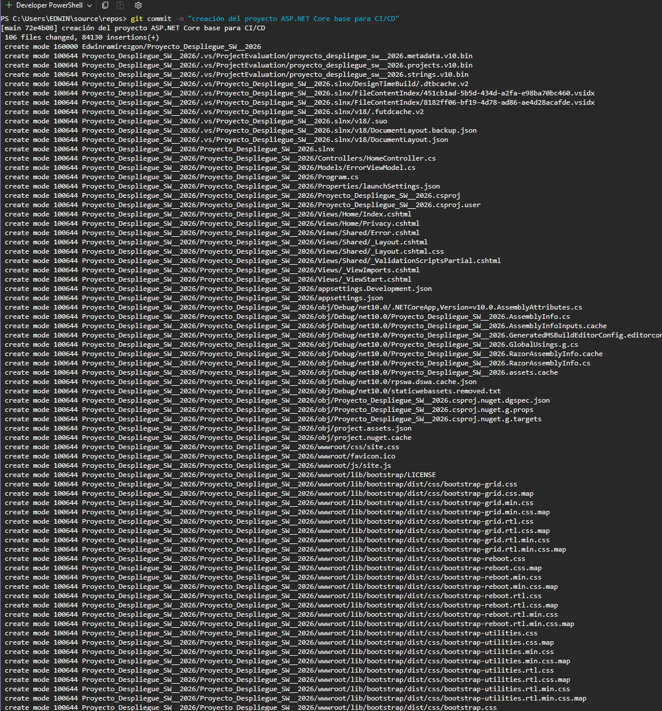

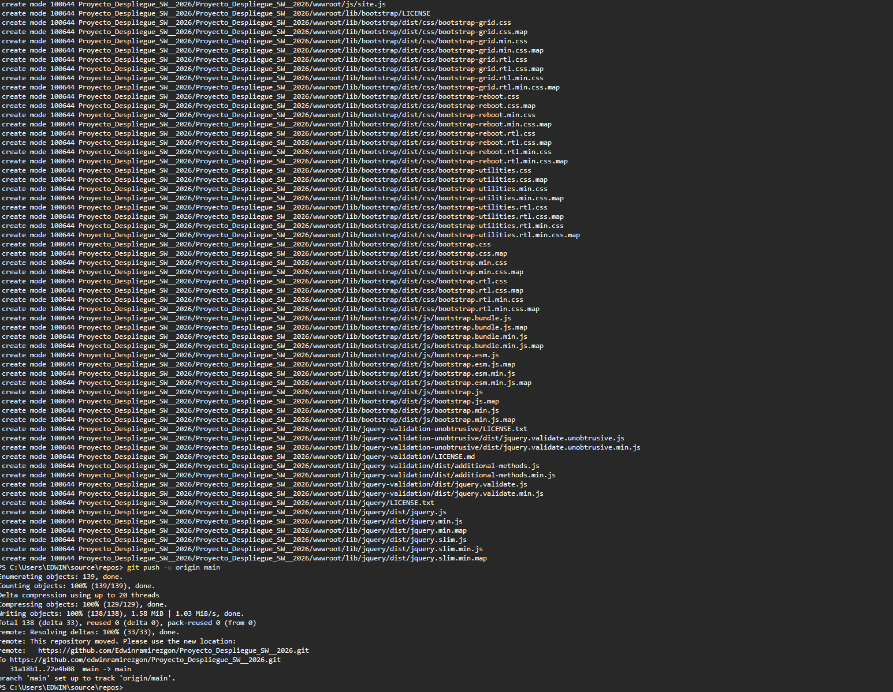

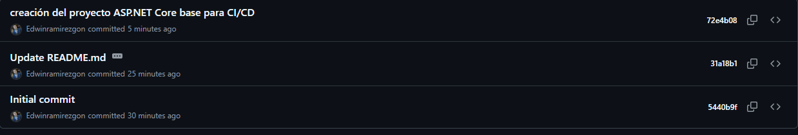

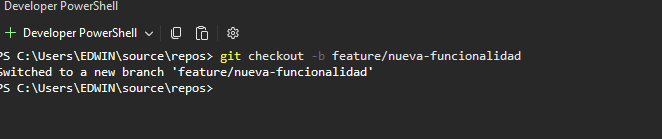

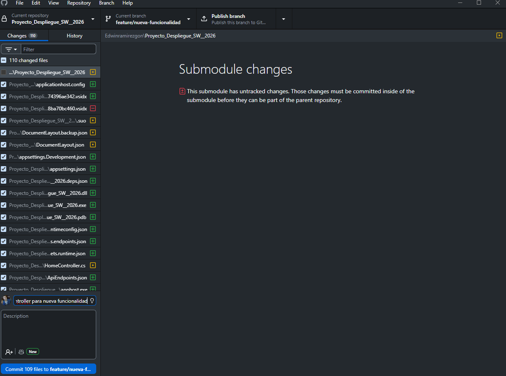

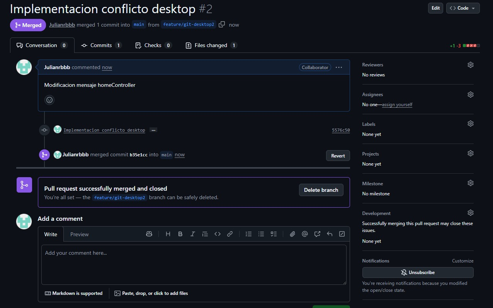

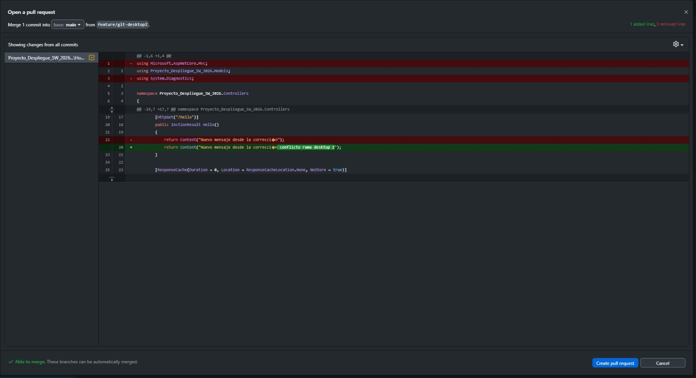

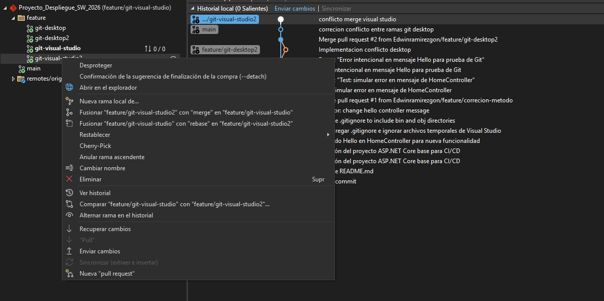

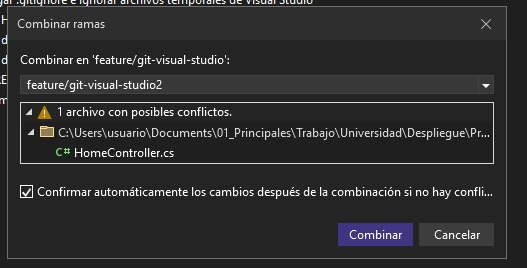

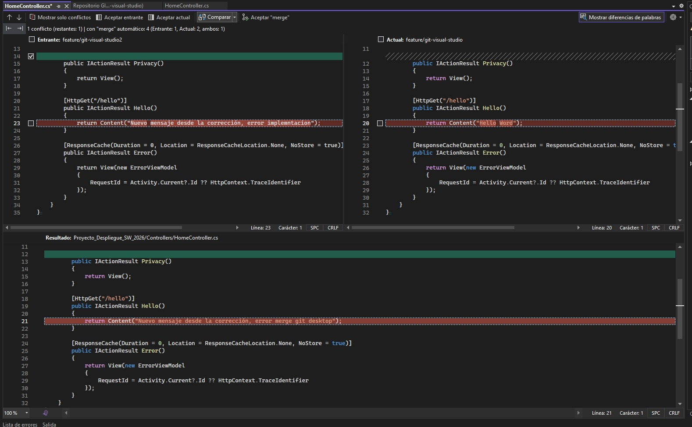

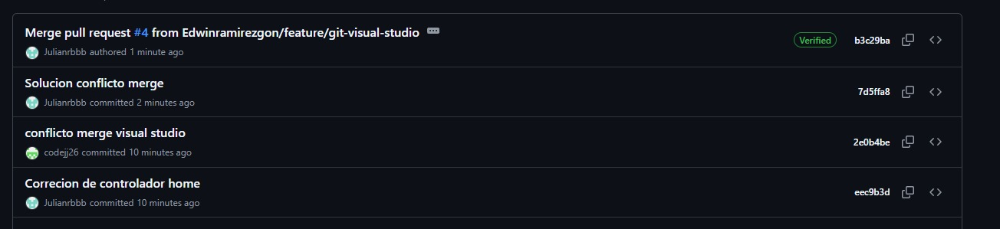

